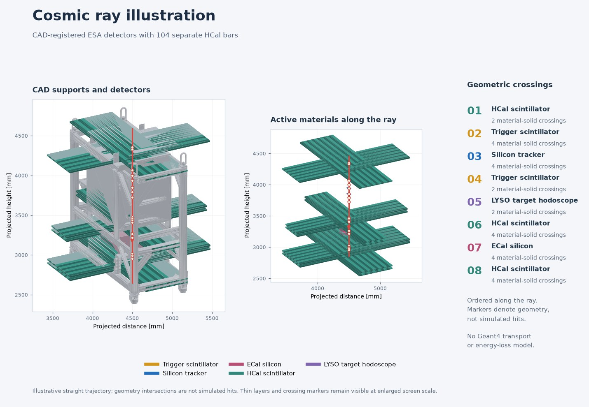
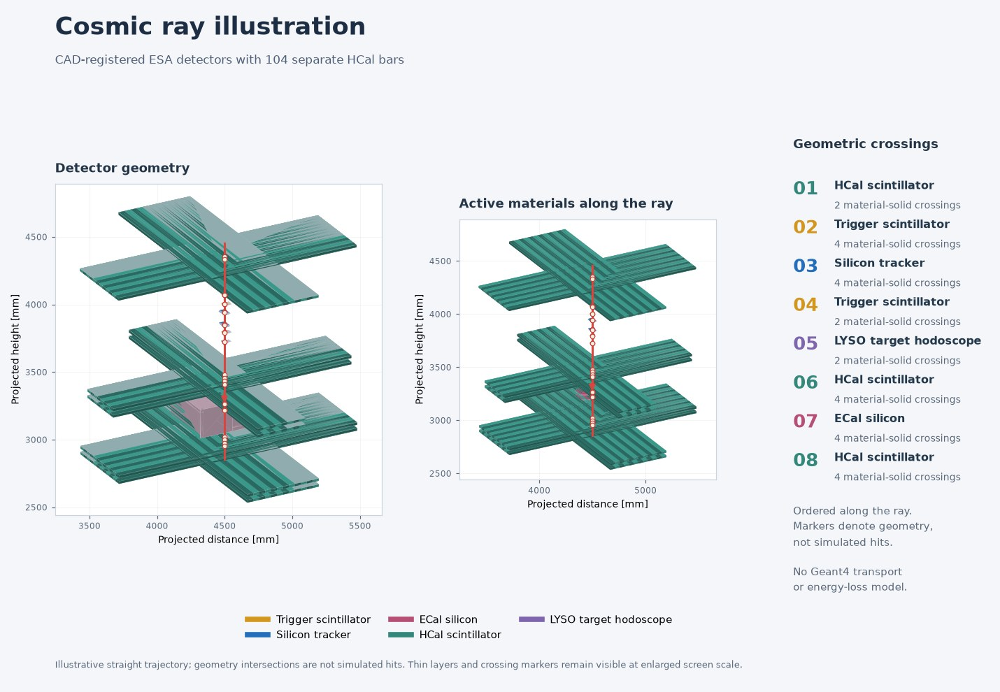

# A viewer for the ESA cosmic stand

This puts the tracker, trigger counters, LYSO target, ECal and HCal in the layout from
`CosmicTestStand.stp`. You can rotate the stand, hide its supports, and follow a
straight example muon through the detectors. The display runs in a browser and
works offline once it has been built.



The gray supports come from the STEP model. The detector internals come from
`ldmx-reduced-v3` and the HCal work in
[`iss2119-add-hcal-teststand-geometry`](https://github.com/LDMX-Software/ldmx-sw/tree/29ee03a8f8fa9eb2ae9c1d29af5e4961ba6c5a0a).
The supports are a simplified display overlay; they are not extra material in the
Geant4 geometry. The full STEP conversion is much too large to put in this PR.
Its input hash and the source occurrence numbers are recorded in `layout.json`.

## Build and open it

You need Python 3.10 or newer and ROOT with GDML support. You do **not** need a full
ldmx-sw build to make the browser display. On macOS, ROOT is available through
`brew install root`. On Linux, use a ROOT installation or Conda environment with
ROOT on `PATH`; the [ROOT installation page](https://root.cern/install/) lists both.

Clone the branch, or use an existing checkout that includes these files:

```sh
git clone --branch epeets https://github.com/LDMX-Software/ldmx-sw.git
cd ldmx-sw
```

Check `python3 --version` first. If it is older than 3.10 (as on some Macs),
use a newer interpreter, such as `python3.13`, for the first command below.

From the root of the checkout:

```sh
python3 -m venv Detectors/tools/cosmic_viewer/.venv
. Detectors/tools/cosmic_viewer/.venv/bin/activate
python -m pip install -r Detectors/tools/cosmic_viewer/requirements.txt
python Detectors/tools/cosmic_viewer/build.py --render
python Detectors/tools/cosmic_viewer/check.py
python Detectors/tools/cosmic_viewer/serve.py
```

The last command opens a local browser tab and prints its address. Keep that
terminal open; Ctrl+C stops the server. Drag to rotate, Shift-drag to pan, and
scroll to zoom. **Focus detectors** hides the supports and passive detector parts.

The finished file, `build/cosmic_ray_interactive.html`, contains its own data and
JavaScript. Send that one file to someone who only wants to look at the stand.
They can open it directly in a WebGL browser without Python, ROOT, or internet
access. The neighboring PNG is useful in slides and for machines without WebGL.

## A closer look at the detectors



To build this view as a separate interactive display:

```sh
python Detectors/tools/cosmic_viewer/render.py --detectors-only
python Detectors/tools/cosmic_viewer/serve.py
```

Run `build.py --render` again to restore the display with the supports. These are
saved views of the generated GDML: changing a geometry file does not update an
already open browser tab. Rebuild, then reload the tab.

## How the HCal is divided

Each bar is a separate scintillator volume. We use the upstream branch's
**2000 × 50 × 20 mm** bars and **0.5 mm aluminum covers**, with crossed layers at
the body centers measured from the newer STEP file:

| Station | Layers | Bars per layer | Total bars |
|---|---:|---:|---:|
| Top of the stand | 2 | 12 | 24 |
| Above ECal | 4 | 8 | 32 |
| Below ECal | 4 | 12 | 48 |

The 12/8/12 counts are inferred from the roughly 602/401/602 mm CAD body widths
at the upstream 50 mm pitch. **Please confirm those counts against the assembled
hardware.** CAD does not tell us the wrapping, gaps or exact bar offset inside a
housing; the current bars are centered on the corresponding body. This is a
concrete starting geometry, not a surveyed alignment.

`bar_positions.json` lists every bar center and copy number. IDs use the branch's
packed version-1 format: `(1<<24) | (section<<16) | (layer<<8) | strip`.
Top uses section 1, above ECal section 0, and below ECal section 2; layers count
from the top of each station, and strips start at zero. The world/station/bar
hierarchy keeps the bar at depth 2, as expected by `HcalSD`.

The legacy `HcalReadoutGeometry` position model describes a different layout.
Do not use it to reconstruct these bar positions. Use the explicit position table
for geometry checks; adapting digitization and reconstruction is still needed.

## Change one component

- **HCal placement, layer orientation or bar count:** edit `hcal_layers` in
  `layout.json`. There is one entry for each of the ten CAD bodies.
- **HCal bar size or cover thickness:** edit the existing constants in
  `Detectors/data/ldmx-esa-cosmic26-v1/constants.gdml`. The builder reads them.
- **Tracker, trigger, LYSO or ECal internals:** edit the corresponding source in
  `Detectors/data/ldmx-reduced-v3/`.
- **Placement of those ESA modules:** edit their transforms in `layout.json`.

Then rerun `build.py --render` and `check.py`. Generated modules live in
`Detectors/data/ldmx-esa-cosmic-cad-v1/`; edits made directly there will be replaced
on the next build. The GDML comments explain its frame, hierarchy and bar IDs.
`provenance.json` records the source and generated-file hashes.

## Use the GDML in Geant4 / LDMX

`detector.gdml` combines the ESA subsystems and the three HCal stations.
`hcal_only.gdml` is a smaller entry point for checking the HCal. The normal
Detectors CMake install step installs these files and rewrites their local GDML
references just like the other detector descriptions.

In a configured LDMX runtime, this example sends one selected 4 GeV muon downward:

```sh
COSMIC_HCAL_ONLY=1 fire Detectors/tools/cosmic_viewer/simulate.py
# Include the tracker, trigger, target and ECal as well:
fire Detectors/tools/cosmic_viewer/simulate.py
```

The configuration deliberately disables sensitive detectors. It checks particle
transport and writes the event, but does not produce `HcalSimHits`. The current
HCal SD also asks `HcalGeometry` for bar-local response coordinates, even for
packed IDs; attaching the old two-station provider would give incorrect coordinates.
It is a geometry-development example, not a cosmic flux generator or a complete
reconstruction job. The browser's crossing markers are independent geometric
intersections, not simulated hits or measured efficiency.

Both entry points also completed a one-event Geant4 transport smoke test in the
prebuilt `ldmx/pro:trunk` runtime. `validation.json` records the image digest and
test scope. This was not a fresh C++ build of this branch. The independently
loadable subsystem files repeat identical material definitions; Geant4 reports
duplicate-material warnings when loading the combined geometry.

The checks cover schema validity, unique bar IDs, containment within each station,
bar-to-bar intersections, and ROOT loading. Whole-detector envelope overlaps,
CAD-to-detector alignment and readout reconstruction still need review. The
tracker dimensions and the four-layer ESA ECal are inherited from the test-slice
model; the newer CAD does not make their internal descriptions a surveyed match.

The original CAD export omitted 965 shape placements. Some unclassified parts
remain in the support overlay. The build and checks also passed in a fresh Python
virtual environment on macOS; the Linux installation
recipe has not been exercised on a clean machine.
